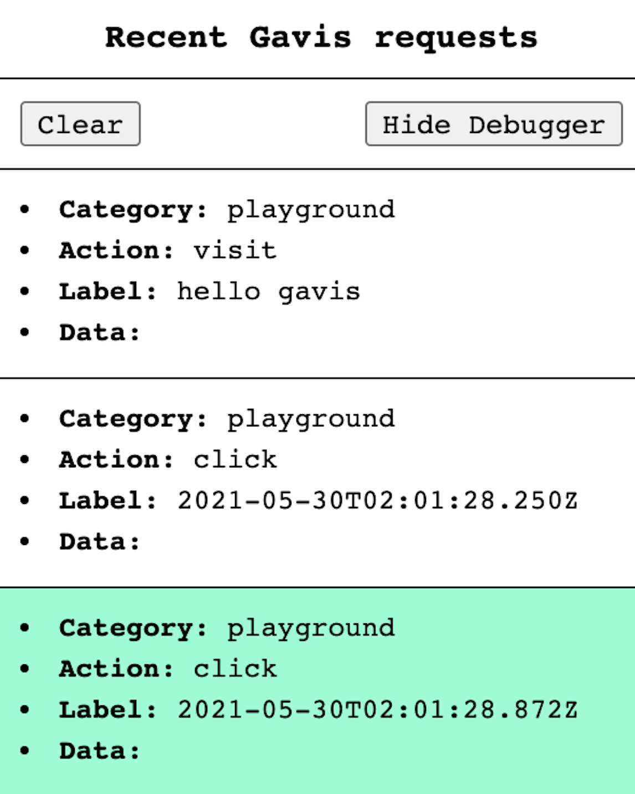

# Debug mode

Gavis supports debug mode to help you test whether logs contain correct data.
If debug mode is enabled, the debugger component will be show in the screen as below.



To enable debug mode, all you need to do is passing `debug` prop to `<GavisConfig/>`

```jsx
<GavisConfig logger={logger} debug={process.env.APPLICATON_STAGE === "LOCAL"}>
```
